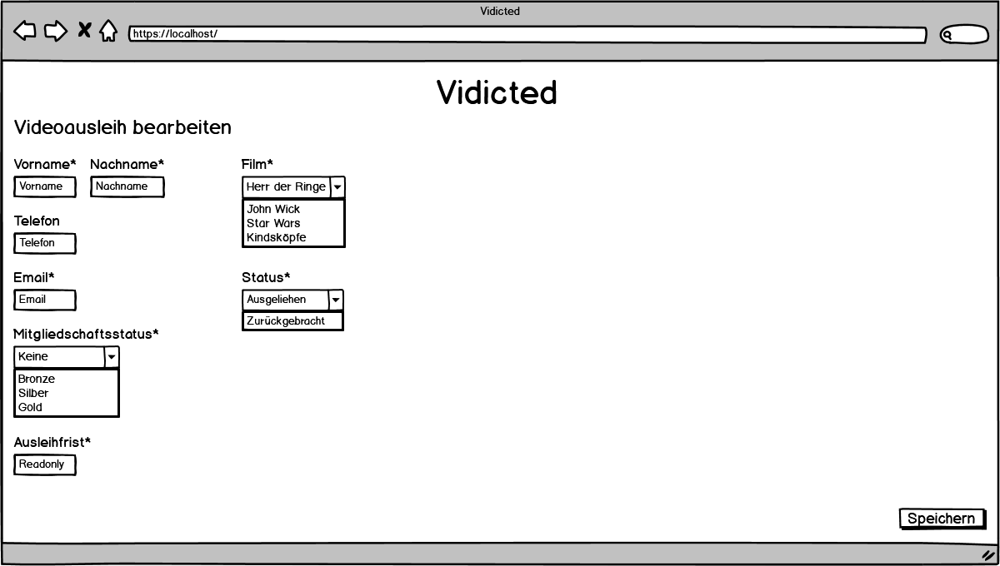
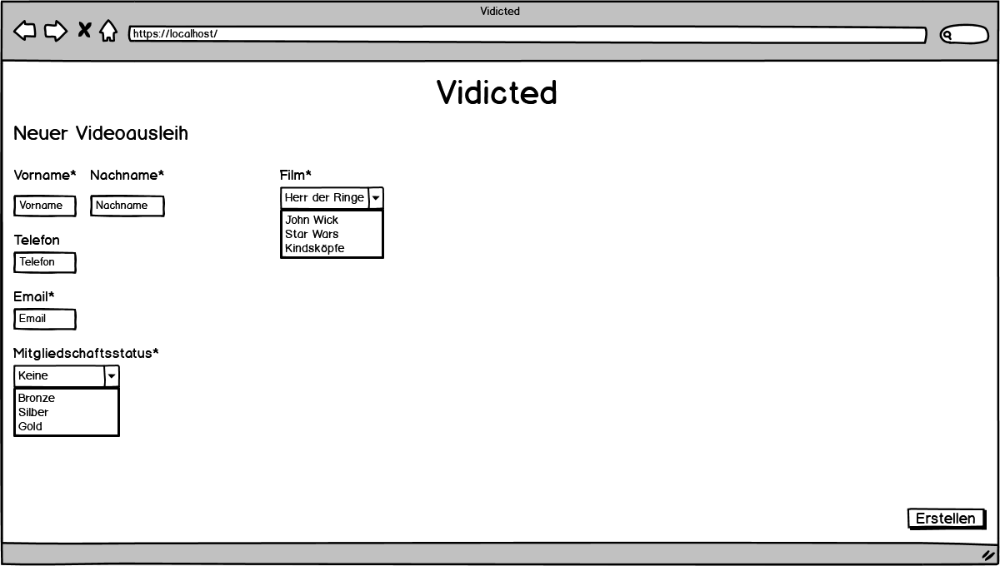

# M307_N&N_Verleih
## Inhaltsverzeichnis
## Einleitung
## Konzeptionierung
### Formulare
#### Home View

#### Edit View

| Bezeichnung | Information | Typ |
| ----------- | ----------- | --- |
| Vorname | Vorname des Kunden |Text|
| Name | Name des Kunden |Text|
| Telefon | Telefonnummer des Kunden |Text|
| Email | Email des Kunden |Text|
| Mitgliedschaftsstatus | Mitgliedschaftsstatus des Kunden |Combobox|
| Ausleihfrist | Ausleihfrist des Filmes |Text|
| Film | Film welcher der Kunde ausgelehnt hat |Combobox|
| Status | Status des Filmes |Combobox|
#### Create View

| Bezeichnung | Information | Typ |
| ----------- | ----------- | --- |
| Vorname | Vorname von Kunden |Text|
| Name | Name des Kunden |Text|
| Telefon | Telefonnummer des Kunden |Text|
| Email | Email des Kunden |Text|
| Mitgliedschaftsstatus | Mitgliedschaftsstatus des Kunden |Combobox|
| Film | Film welcher der Kunde auslehnen möchte |Combobox|
### Validierung
#### Create View Validierung
| Formularfeld | Validierung | zwingend |
| ----------- | ----------- | :---: |
| Vorname | Keine Sonder Zeichen |✅|
| Name | Keine Sonder Zeichen |✅|
| Telefon | Keine Sonder Zeichen ||
| Email | Keine Sonder Zeichen |✅|
| Mitgliedschaftsstatus | - |✅|
| Film | - |✅|
#### Edit View Validierung
| Formularfeld | Validierung | zwingend |
| ----------- | ----------- | :---: |
| Vorname | Keine Sonder Zeichen |✅|
| Name | Keine Sonder Zeichen |✅|
| Telefon | Keine Sonder Zeichen ||
| Email | Keine Sonder Zeichen |✅|
| Mitgliedschaftsstatus | - |✅|
| Film | - |✅|
| Ausleihfrist | - ||
| Status | - |✅|
### Datenbank
#### movies
| Bezeichnung | Typ |
| ----------- | ----------- |
| id | int(11) |
| title | varchar(255) NOT NULL|
#### loans
| Bezeichnung | Typ |
| ----------- | ----------- |
| id | int |
| loandate | date |
| returndate | date |
| movie | int |
| status | bool |
#### customers
| Bezeichnung | Typ |
| ----------- | ----------- |
| id | int |
| firstname | varchar(255) NOT NULL|
| lastname | varchar(255) NOT NULL|
| email | varchar(255) NOT NULL|
#### memberships 
| Bezeichnung | Typ |
| ----------- | ----------- |
| id | int |
| membership	 | varchar(255) NOT NULL |
| loan_period | int |
### Testfälle
#### Testfälle 1
```
GEGEBEN       Erstelle Seite ist geöffnet und alle Daten sind richtig richtig eingegeben
WENN          Ich drücke auf den Erstellen Button
DANN          Der Videoausleih wir in der Datenbank erstellt und ich werde auf die Home Seite umgeleitet
```
#### Testfälle 2
```
GEGEBEN       Ein Videoausleih ist auf der Bearbeitungsseite geöffnet
WENN          Ich ändere den Namen des Kunden auf Tim und speichere den Ausleih
DANN          Der Videoausleih wir in der Datenbank geändert und ich werde auf die Home Seite umgeleitet wo der Name Tim beim Videoausleih steht
```
#### Testfälle 3
```
GEGEBEN       Die URL der Homeseite ist im Browser eingeben
WENN          ich die Seite lade 
DANN          sehe ich alle Ausleihen die noch nicht abgeschlossen sind
```
#### Testfälle 4
```
GEGEBEN       Erstelle Seite ist geöffnet
WENN          ich den Mitgliedstatus eingebe
DANN          sehe ich das Rückgabedatum
```
#### Testfälle 5
```
GEGEBEN       Home Seite ist geöffnet
WENN          eine Ausleihung fälig ist 
DANN          wird das mit einem passendem Emoji angezeigt
```
#### Testfälle 6
```
GEGEBEN       Home Seite ist geöffnet
WENN          eine Ausleihung noch nicht fälig ist 
DANN          wird das mit einem passendem Emoji angezeigt
```
#### Testfälle 7
```
GEGEBEN       Erstelle Seite ist geöffnet
WENN          ich das Formular ohne Eingaben absende
DANN          werden die Error Meldungen angezeigt
```
#### Testfälle 8
```
GEGEBEN       Update Seite ist geöffnet
WENN          ich alle Daten aus den Textboxen lösche
DANN          werden die Error Meldungen angezeigt
```
#### Testfälle 9
```
GEGEBEN       Home Seite ist geöffnet 
WENN          ich erstelle 2 Ausleihungen
DANN          wird die zuerst erstellt zu oberst angezeigt
```
#### Testfälle 10
```
GEGEBEN       Update Seite ist geöffnet
WENN          eine Ausleihung abschliesse
DANN          wird diese nicht mehr angezeigt
```
### Roadmap
| 05.05.2020            | 06.05.2020                     | 07.05.2020                             |
|-----------------------|--------------------------------|----------------------------------------|
|                       | Noah : Datenbank aufsetzten    | Noah:  Createseite (Controller)                   | 
|                       | Models                         | Updateseite (Controller)                                |
|                       | Createseite (View)             |                                 |
|                       | Nick: Alle Seiten Vorbereiten  | Nick: Welcomeseite (Controller)  | 
|                       | Router    |                       Updateseite(View                 |
|                       | Welcomeseite (View) |                                        | 
|                       |                                |                                        | 
| Git Repo erstellen    | Noah: Createseite (Controller)          | Noah: Testing | 
| Mokups erstellen       | Nick: Welcomeseite (Controller)            | Feinschliff               |
| Testfälle erstellen     | 14:30Uhr Zwischengespräch mit Auftraggeber | Nick: Testing       |
| Validierung beschrieben |         |               Feinschliff     | 
